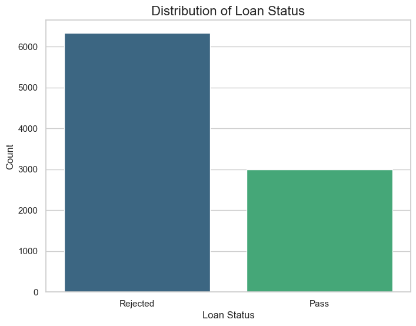
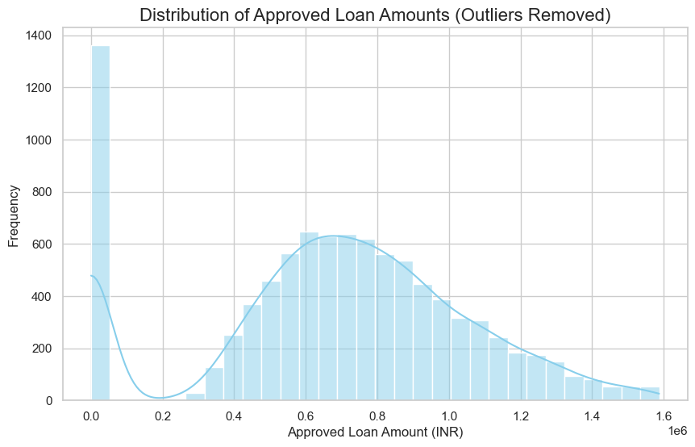
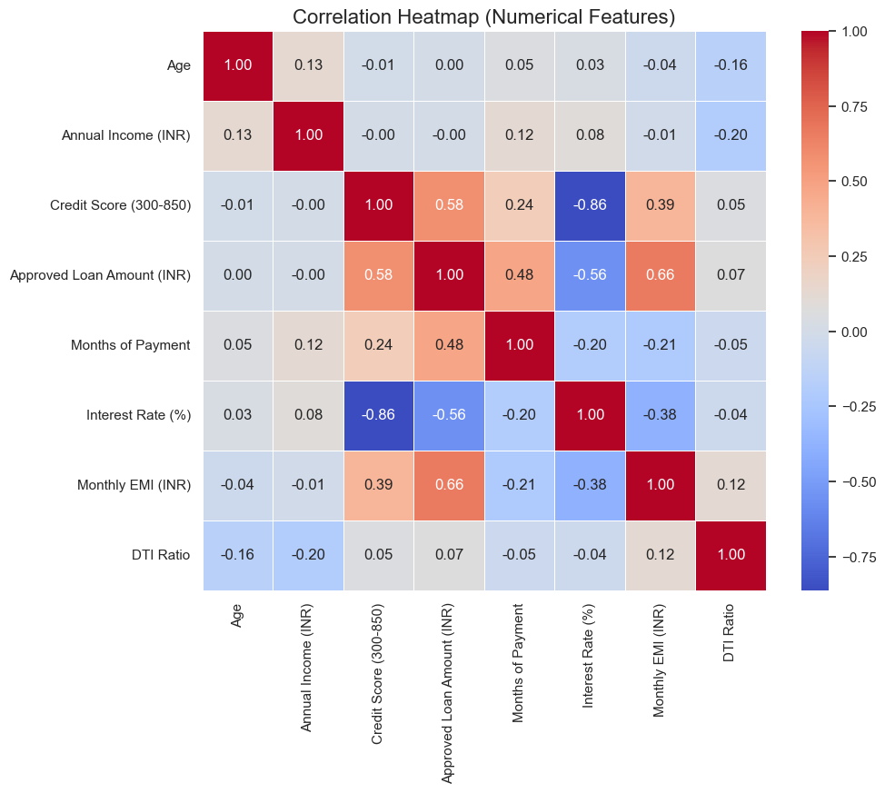

# 🏦 Banking Loan Prediction System


## 📌 Overview

The **Banking Loan Prediction System** is an AI-powered web application designed to help financial institutions and applicants estimate the likelihood of loan approval. By leveraging Machine Learning algorithms, this tool analyzes key financial and demographic factors to provide an instant prediction with a confidence score.

## ✨ Features

- **Instant Prediction**: Get real-time feedback on loan application status (Approved/Rejected).
- **User-Friendly Interface**: Interactive forms built with [Streamlit](https://streamlit.io/) for effortless data entry.
- **Detailed Insights**: View the confidence level of the model's prediction.
- **Responsive Design**: Works seamlessly on desktop and mobile devices.

## 📊 Data Analysis

Here are some insights from the dataset used to train the model. Note that outliers were removed for a clearer representation.

### Loan Status Distribution

*Distribution of approved vs. rejected loans.*

### Loan Amount Distribution

*Distribution of the approved loan amounts.*

### Correlation Heatmap

*Correlation between different numerical features.*

## 🚀 Installation

Follow these steps to set up the project locally.

### Prerequisites

- Python 3.8 or higher installed.
- Git installed.

### Steps

1. **Clone the repository**
   ```bash
   git clone https://github.com/aswindev-tech/loan-prediction.git
   cd loan-prediction
   ```

2. **Create a virtual environment (Optional but recommended)**
   ```bash
   python -m venv venv
   # Windows
   venv\Scripts\activate
   # macOS/Linux
   source venv/bin/activate
   ```

3. **Install dependencies**
   ```bash
   pip install -r requirements.txt
   ```

4. **Run the application**
   ```bash
   streamlit run app.py
   ```

## 🛠️ Tech Stack

- **Frontend**: Streamlit
- **Machine Learning**: Scikit-Learn
- **Data Processing**: Pandas, NumPy
- **Language**: Python


---
 
by [Aswin Dev](https://github.com/aswindev-tech)
